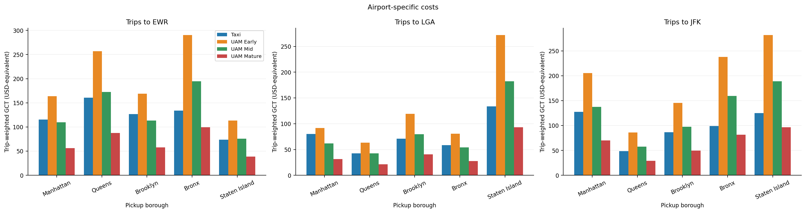

# AIAAScitech-2026

Reproducible generalized-cost and Urban Air Mobility (UAM) mode-switching analysis for airport trips to Newark Liberty (EWR), LaGuardia (LGA), and John F. Kennedy (JFK).

Based on **Urban Air Mobility Flight Demand Modeling for Airports in New York City**, by Kamal Acharya, Houbing Song, Katherine Vasiloff, Zhenbo Wang, and Liang Sun (2026). See [citation metadata](CITATION.cff) and [research notes](docs/RESEARCH.md).

**Reproduction starts from the included hourly summaries.** No downloads or API keys are needed to generate results. The raw 2023 TLC trips and the original complete preprocessing pipeline are not included. Figures reproduce the analysis families in paper Figures 4–7; exact agreement with every published value or image is not claimed.


## Quick start

Use Python **3.12**. From a terminal:

```bash
git clone https://github.com/lotussavy/AIAAScitech-2026.git
cd AIAAScitech-2026
python3 -m venv .venv
source .venv/bin/activate
python -m pip install -r requirements.txt
python -m unittest discover -s tests -v
python -m uam_demand --verify-inputs
```

On Windows, create the environment with `py -3.12 -m venv .venv` and activate it with `.venv\Scripts\Activate.ps1` in PowerShell. The remaining `python` commands are the same.

Results appear in `outputs/corrected/`. The run writes final GCT CSVs, plot-source tables, PNG/PDF figures, and a `run_manifest.json` containing input hashes, parameters, package versions, and an audit against the supplied reference CSVs.

```bash
# Recreate figures from supplied historical GCT CSVs, with their documented EWR issue:
python -m uam_demand --mode archived --verify-inputs

# Analyze only one airport:
python -m uam_demand --airports EWR

# Generate tables without rendering figures:
python -m uam_demand --no-plots

# Run a parameter experiment without overwriting baseline output:
python -m uam_demand --config my_config.json --output outputs/experiment
```

Copy `config.json` to `my_config.json` before editing parameters. Use corrected mode for cost experiments. Repeating a run replaces files in its output directory. Use a new `--output` directory for each experiment.

## Outputs and paper mapping

| Output under `outputs/<mode>/figures/` | Paper correspondence |
|---|---|
| `fig4_top10_zone_gct.png` / `.pdf` | Figure 4: top ten pickup zones by trip count, EWR/LGA/JFK |
| `fig5_hourly_top3_switching.png` / `.pdf` | Figure 5: hourly switching for the top three pickup zones |
| `fig6_borough_gct.png` / `.pdf` | Figure 6: trip-weighted GCT for all five NYC boroughs |
| `fig7_hourly_borough_switching.png` / `.pdf` | Figure 7: Manhattan, Brooklyn, and Queens hourly switching |
| `hourly_all5_borough_switching.png` / `.pdf` | Extension: hourly switching for all five boroughs |

Each airport directory also includes `Final_<AIRPORT>_UAM_GCT.csv`, `airport_bound.csv`, `zone_gct.csv`, `borough_gct.csv`, `hourly_zone_switching.csv`, `hourly_borough_switching.csv`, and `hourly_zone_gct.csv`. All plots use airport-bound trips; final cost CSVs retain both available directions. Paper Figures 1–3 describe the workflow and geography; this package does not regenerate those original illustrations.



The preview uses corrected costs. See [baseline verification results](docs/VALIDATION.md) for expected counts and numerical differences.

## Notebooks

Install optional notebook support, then open either notebook in VS Code or an existing Jupyter installation and select the Python environment:

```bash
python -m pip install -r requirements-notebooks.txt
python -m ipykernel install --user --name aiaa-scitech-2026 --display-name "AIAA SciTech 2026"
```

- [AirpportsTaxiCode.ipynb](notebooks/AirpportsTaxiCode.ipynb): calculate and export GCT for a selected airport. The original filename is retained for familiarity.
- [GCT.ipynb](notebooks/GCT.ipynb): regenerate the full analysis and display the result figures.

The notebooks call the same tested Python functions as the command line and can each run from a fresh kernel. To execute both without an editor: `python scripts/execute_notebooks.py`. Executed copies are saved under `outputs/notebooks/`; committed notebooks contain no cached results.

## Model

```text
Taxi GCT = mean fare + VOT × mean duration
           + VOR × (duration std + distance std / mean speed)
UAM GCT  = distance × cost per mile + VOT × distance / cruise speed
P(UAM)   = 1 / (1 + exp(lambda × (UAM GCT - Taxi GCT)))
```

Time is in hours, distance in miles, speed in mph, and GCT in USD-equivalent. VOT = 41.9 USD/hour; VOR = 0.8 × VOT; lambda = 0.1 per USD. Taxi GCT is rounded to two decimals before switching calculations to preserve the notebook convention. UAM GCT is not rounded.

| Phase | USD per passenger-mile | Cruise speed (mph) |
|---|---:|---:|
| Early | 15 | 125 |
| Mid | 10 | 150 |
| Mature | 5 | 175 |

Rows are OD/hour groups, weighted by `num_trips`. Switching probabilities are calculated for each group before aggregation. Zones 264 and 265 are excluded at both endpoints. Five-borough charts keep every borough label; missing observations are marked as missing rather than zero cost. No boarding, access, ascent/descent, capacity, or weather penalty is added to the paper's Equation 2.

## Repository contents

```text
config.json                  Model parameters
data/hourly/                 Three airport hourly summary inputs
data/taxi_zones.csv          Zone-to-borough lookup
data/taxi_zone_airport_distances.csv  Supplied airport distances
data/reference/              Historical GCT CSVs (including the documented EWR issue)
data/sha256.json             Checksums of all nine bundled CSV inputs
uam_demand/                 Shared calculations, plots, and command-line entry point
notebooks/                  Two independent notebook interfaces
tests/                      Formula, filtering, weighting, and data regression checks
docs/                       Data dictionary, provenance, research, and reproduction limits
scripts/                    Notebook execution helper
.github/workflows/           Automated reproduction and downloadable result artifacts
```

See [DATA.md](docs/DATA.md) for the input schema and [CONTRIBUTING.md](CONTRIBUTING.md) for development. Code is licensed under [BSD-3-Clause](LICENSE); source data and paper rights are described in [DATA_LICENSE.md](DATA_LICENSE.md).
